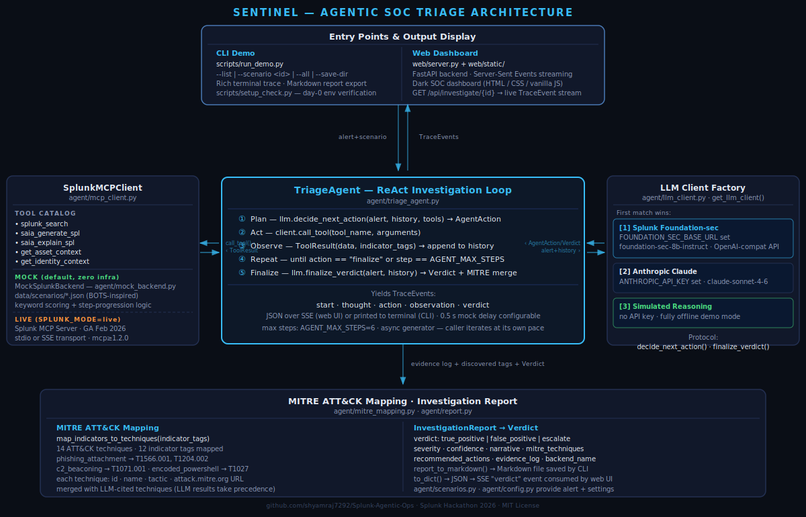

# Sentinel — Agentic SOC Tier-1 Triage Analyst

> Built for the **Splunk Hackathon 2026** · Security track
>
> Targeting: **Best of Security ($3 000)** · **Best Use of Splunk MCP Server ($1 000)** · **Best Use of Hosted Models ($1 000)**

Sentinel is an autonomous SOC analyst agent that takes a Splunk notable event and
works through it end-to-end the way a Tier-1 analyst would: it forms a hypothesis,
calls Splunk tools to gather evidence, tracks what it has found, and issues a
structured verdict — all in a streaming live trace you can watch in the terminal or
a web dashboard.

---

## The problem

SOC teams are drowning in alert volume. Tier-1 triage — pulling correlated logs,
enriching IPs and users, mapping findings to ATT&CK, writing up a recommendation —
is repetitive enough to automate but nuanced enough that a dumb rule engine
constantly misfires. What's needed is an analyst that *reasons*, not just matches.

## What Sentinel does

| Capability | Detail |
|---|---|
| **Agentic ReAct loop** | Plan → Act → Observe → Repeat → Finalize. Runs until the model decides it has enough evidence or `AGENT_MAX_STEPS` is hit. |
| **Splunk MCP Server** | Calls real Splunk tools (`splunk_search`, `saia_generate_spl`, `saia_explain_spl`, `get_asset_context`, `get_identity_context`) via the official `mcp` SDK. |
| **MITRE ATT&CK mapping** | Every evidence step emits `indicator_tags`; these map automatically to technique IDs, names, tactics, and attack.mitre.org links. |
| **Three reasoning backends** | Foundation-sec (Splunk hosted model) → Anthropic Claude → Simulated Reasoning, first match wins. |
| **Live streaming trace** | Every thought, tool call, and observation is yielded as a `TraceEvent` and streamed in real time over SSE (web) or printed to the terminal (CLI). |
| **Offline-first mock mode** | The entire agent — including all three bundled scenarios — runs with zero external services. `SPLUNK_MODE=mock` (default). |
| **BOTS-inspired scenarios** | Three realistic, multi-step scenarios with canned Splunk results, expert-authored ground truth verdicts, and automatic MITRE technique validation. |

---

## Quick start (60 seconds, zero config)

```bash
git clone https://github.com/shyamraj7292/Splunk-Agentic-Ops.git
cd Splunk-Agentic-Ops
pip install -r requirements.txt

# Verify the environment
python scripts/setup_check.py

# Run the CLI demo — PowerShell phishing scenario
python scripts/run_demo.py --scenario powershell_encoded_cmd

# Run all three bundled scenarios
python scripts/run_demo.py --all
```

No `.env` needed. No Splunk. No API keys. The agent uses **Simulated Reasoning**
(the built-in offline backend) and the bundled mock Splunk data automatically.

---

## Web dashboard

```bash
python web/server.py
# Open http://localhost:8000
```

Pick a scenario from the sidebar, click **Run Investigation**, and watch the agent
think through each step live. The final report shows verdict badge, confidence
percentage bar, MITRE ATT&CK technique chips (linked to attack.mitre.org), and a
recommended-actions checklist.



---

## Live mode — Splunk MCP Server + Foundation-sec

Copy `.env.example` to `.env` and fill in your credentials:

```bash
cp .env.example .env
```

### Foundation-sec hosted model (Best Use of Hosted Models)

```env
FOUNDATION_SEC_BASE_URL=https://<your-foundation-sec-endpoint>
FOUNDATION_SEC_API_KEY=<key>
FOUNDATION_SEC_MODEL=foundation-sec-8b-instruct
```

### Splunk MCP Server (Best Use of MCP Server)

```env
SPLUNK_MODE=live
MCP_TRANSPORT=stdio
MCP_SERVER_COMMAND=uvx splunk-mcp-server
SPLUNK_HOST=<your-splunk-host>
SPLUNK_PORT=8089
SPLUNK_USERNAME=admin
SPLUNK_PASSWORD=<password>
```

Then run as normal — the agent switches automatically from the mock backend to the
real Splunk MCP Server and from Simulated Reasoning to Foundation-sec.

---

## Configuration reference

All settings are environment variables (loaded from `.env` via python-dotenv).

| Variable | Default | Description |
|---|---|---|
| `SPLUNK_MODE` | `mock` | `mock` = offline bundled data · `live` = real Splunk MCP Server |
| `AGENT_MAX_STEPS` | `6` | Maximum ReAct steps before forcing a verdict |
| `DEMO_STEP_DELAY_SECONDS` | `0.5` | Artificial delay between mock events in web UI (set `0` for tests) |
| `WEB_HOST` | `0.0.0.0` | Uvicorn bind host |
| `WEB_PORT` | `8000` | Uvicorn bind port |
| `MCP_TRANSPORT` | `stdio` | `stdio` (subprocess) or `sse`/`http` (network) |
| `MCP_SERVER_COMMAND` | _(empty)_ | Command to launch MCP server, e.g. `uvx splunk-mcp-server` |
| `MCP_SERVER_URL` | _(empty)_ | URL for SSE transport, e.g. `http://localhost:8765/sse` |
| `SPLUNK_HOST` | `localhost` | Splunk REST API host |
| `SPLUNK_PORT` | `8089` | Splunk REST API port |
| `SPLUNK_USERNAME` | `admin` | Splunk username |
| `SPLUNK_PASSWORD` | _(empty)_ | Splunk password |
| `SPLUNK_TOKEN` | _(empty)_ | Splunk bearer token (alternative to password) |
| `FOUNDATION_SEC_BASE_URL` | _(empty)_ | Splunk Foundation-sec OpenAI-compatible base URL |
| `FOUNDATION_SEC_API_KEY` | _(empty)_ | Foundation-sec API key |
| `FOUNDATION_SEC_MODEL` | `foundation-sec-8b-instruct` | Foundation-sec model name |
| `ANTHROPIC_API_KEY` | _(empty)_ | Anthropic API key (fallback backend) |
| `ANTHROPIC_MODEL` | `claude-sonnet-4-6` | Anthropic model ID |

---

## Bundled scenarios

| ID | Title | Category | Steps | Verdict |
|---|---|---|---|---|
| `powershell_encoded_cmd` | Encoded PowerShell Spawned by Office Document | endpoint | 6 | TRUE POSITIVE / critical / 95% |
| `brute_force_credential_access` | Service Account Brute Force + AD Reconnaissance | identity | 5 | TRUE POSITIVE / critical / 91% |
| `insider_data_staging_exfil` | After-Hours Archive Staging and Exfiltration | data_loss | 5 | TRUE POSITIVE / critical / 89% |

All scenarios ship with expert-authored ground truth (verdict, severity, confidence,
narrative, recommended actions, and MITRE indicator tags) used both as demo content
and as the test oracle for the automated test suite.

---

## Project structure

```
Splunk-Agentic-Ops/
├── agent/
│   ├── config.py           # Env-driven configuration (Config / MCPConfig / LLMConfig)
│   ├── scenarios.py         # BOTS-inspired scenario loader (Scenario / ScenarioStep)
│   ├── mitre_mapping.py     # ATT&CK technique knowledge base + indicator_tag map
│   ├── mock_backend.py      # Offline Splunk simulation (MockSplunkBackend)
│   ├── mcp_client.py        # Unified MCP client — mock or live Splunk MCP Server
│   ├── llm_client.py         # Reasoning backends: Foundation-sec / Claude / Simulated
│   ├── triage_agent.py       # TriageAgent — async ReAct loop, yields TraceEvents
│   └── report.py             # TraceEvent · InvestigationReport · report_to_markdown()
├── data/scenarios/            # Bundled alert scenarios (JSON)
├── scripts/
│   ├── setup_check.py        # Day-0 environment verification
│   └── run_demo.py            # CLI demo runner (Rich terminal UI)
├── web/
│   ├── server.py              # FastAPI: /api/status · /api/scenarios · /api/investigate/{id}
│   └── static/                # index.html · style.css · app.js
├── tests/
│   ├── test_agent.py          # 19 tests: config, scenarios, MITRE, mock backend, end-to-end
│   └── test_web.py            # 5 tests: status, scenarios, SSE stream to verdict
├── docs/DEMO_SCRIPT.md        # Demo video script (~3 minutes)
├── ARCHITECTURE.md
├── architecture-diagram.svg
├── requirements.txt
├── pytest.ini
├── .env.example
└── LICENSE                    # MIT
```

---

## Testing

```bash
python -m pytest -q
# 23 passed, 1 warning
```

The suite covers config, scenario loading, MITRE mapping, mock-backend step
progression (including a regression test for the keyword tie-breaking fix), full
end-to-end investigations for all three scenarios verified against ground truth, and
all five FastAPI endpoints.

---

## Hackathon track alignment

### Best of Security ($3 000)
Sentinel automates the most time-consuming part of SOC work: correlating
multi-source evidence, mapping it to ATT&CK, and producing a structured, actionable
verdict with specific hosts, users, IPs, timestamps, and a recommended-actions
checklist ready for an IR team to execute.

### Best Use of Splunk MCP Server ($1 000)
`SplunkMCPClient` wraps the Splunk MCP Server (GA February 2026) using the official
`mcp` Python SDK. The agent treats `splunk_search`, `saia_generate_spl`,
`saia_explain_spl`, `get_asset_context`, and `get_identity_context` as its tool
catalog, fed directly to the LLM's function-calling schema. Switching from the
offline mock to a live Splunk instance is a single env-var change
(`SPLUNK_MODE=live`).

### Best Use of Hosted Models ($1 000)
`FoundationSecClient` connects to Splunk's hosted Foundation-sec model over its
OpenAI-compatible endpoint. Foundation-sec is a security-domain-tuned model that
understands SPL, ATT&CK, and SOC terminology. When the endpoint is configured, every
`decide_next_action` and `finalize_verdict` call goes through Foundation-sec;
otherwise the agent falls back to Anthropic Claude or the offline Simulated Reasoning
backend — so the demo always runs regardless of credential availability.

---

## License

MIT — see [LICENSE](LICENSE).
